# 👋 Hello, I am Rod Oliveira

Software Developer based in Halifax, Canada. Focused on backend systems and AI-driven applications.

I build practical systems that integrate APIs, messaging, and large language models, with an emphasis on clean
architecture and real-world use.

---

## 🚀 What I Do

- Build backend applications using Java and Spring Boot
- Design and integrate REST APIs and event-driven systems
- Develop AI-enabled applications using multiple LLM providers
- Deploy and enhance applications with cloud, containers, and observability

---

## 🧩 Featured Projects

### 🔹 [GenAI Lab](https://github.com/jrodolfo/local-genai-lab)
Local experimentation platform integrating multiple LLM providers with:
- streaming responses  
- persistent chat sessions  
- tool-assisted interactions

---

### 🔹 [Solace API Integration](https://github.com/jrodolfo/solace)
Backend service integrating with Solace PubSub+ for event-driven systems

---

### 🔹 [Job Portal Application](https://github.com/jrodolfo/job-portal)
Expanded beyond the original learning project with:
- AWS deployment  
- Docker support  
- OpenTelemetry integration  
- Structural refactoring and stability improvements

---

## 🛠️ Tech Stack

**Backend:** Java, Spring Boot  
**Frontend:** React  
**AI / LLMs:** Ollama, Amazon Bedrock, Hugging Face  
**Cloud:** AWS  
**Messaging:** Solace PubSub+  
**Database:** MySQL  
**Tools:** Docker, Git, Jenkins, OpenTelemetry  

---

## 📊 GitHub Stats & Top Languages

  
  

---

## 🌐 Links

- 🌍 [Website](https://jrodolfo.net)
- 💼 [LinkedIn](https://linkedin.com/in/rodoliveira)

---

## 📬 Contact

Open to software engineering opportunities, especially in backend and AI-related roles.
Email: [jrodolfo@gmail.com](mailto:jrodolfo@gmail.com)
